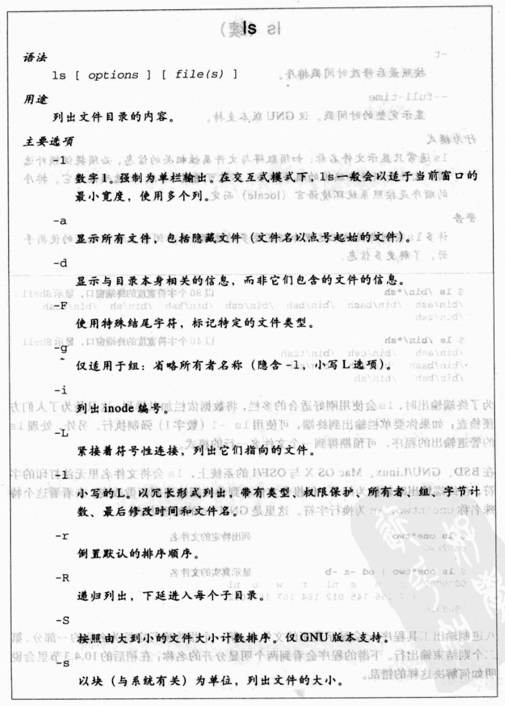
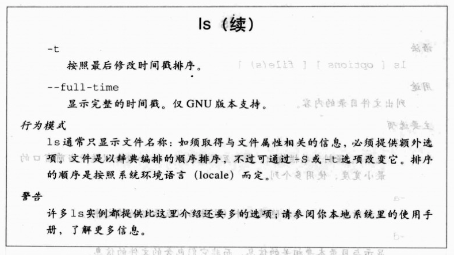
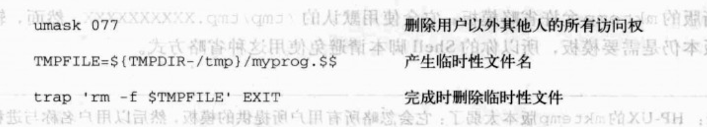
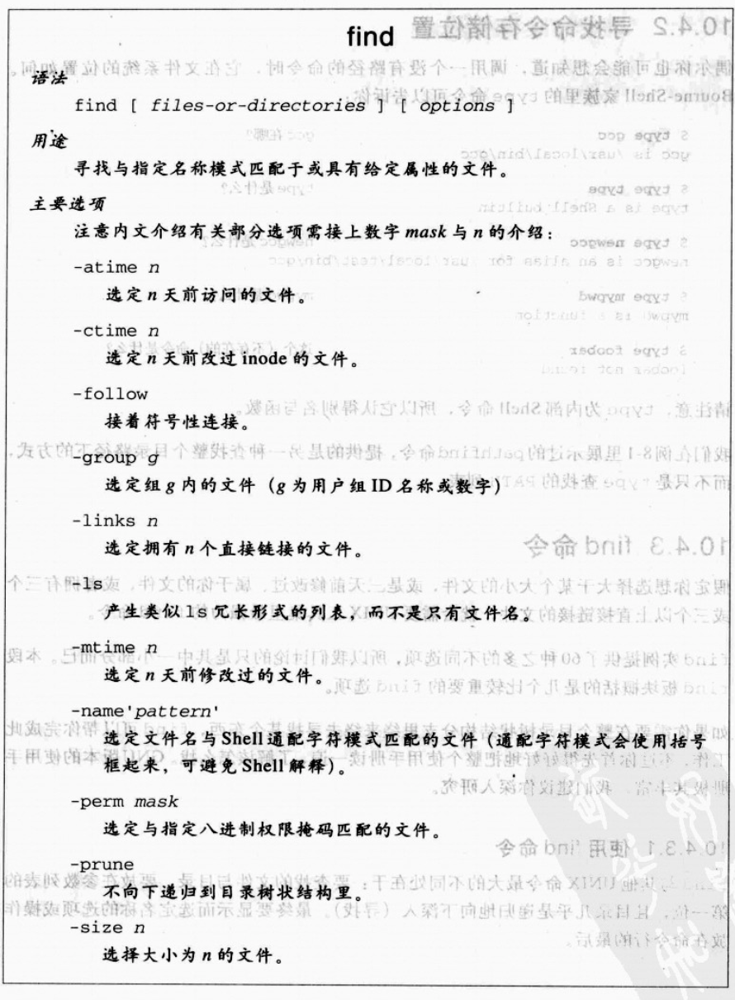
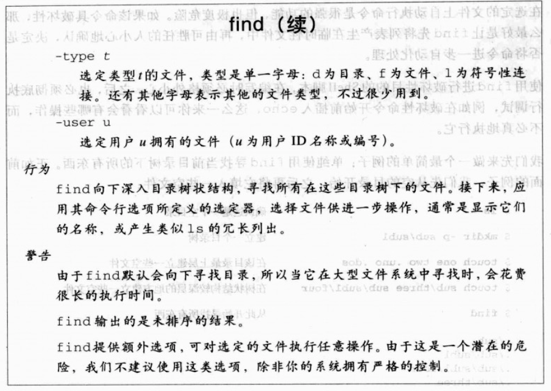
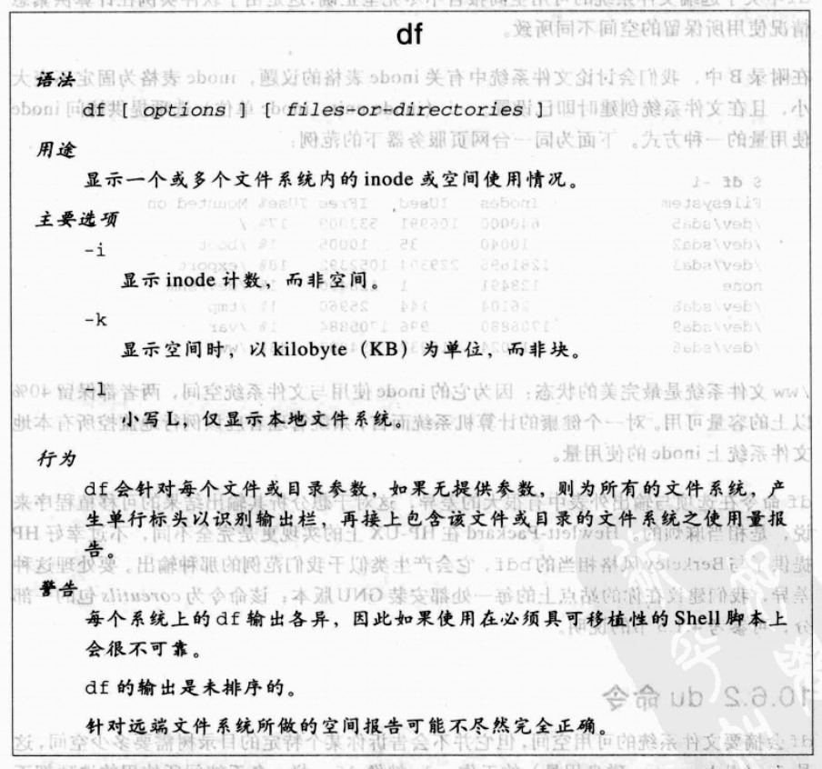
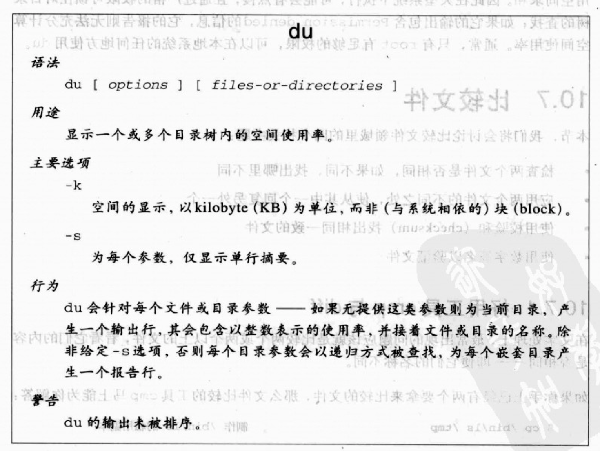

## 10.1 列出文件

> ls命令列出文件:





> echo 命令列出匹配文件

  ```
  $echo /bin/*sh  显示/bin下的shell
  /bin/ash /bin/bash  /bin/bsh  /bin/csh
  ```
  
### 10.1.1 长的文件列出

`-l`选项列出的内容的类型、权限保护、所有者、组、字节计数、最后修改时间和文件名

```

$ls -l   列出当前文件夹下的内容
drwxr-xr-x   4 liuhuajian  staff    136  1  8 22:58 Examples
-rw-r--r--   1 liuhuajian  staff     44  6 28  2017 README.md
drwxr-xr-x  54 liuhuajian  staff   1836  2  2 15:12 image
-rw-r--r--@  1 liuhuajian  staff    254  2  2 15:15 第10章:文件处理.md
-rw-r--r--@  1 liuhuajian  staff   6652  1  2 22:41 第2章 入门.md
-rw-r--r--@  1 liuhuajian  staff  11348  1  4 23:32 第3章 查找与替换.md
-rw-r--r--@  1 liuhuajian  staff   5126  1  9 16:59 第4章:文本处理工具.md
-rw-r--r--@  1 liuhuajian  staff    373  1  9 21:56 第5章:管道的神器魔力.md
-rw-r--r--@  1 liuhuajian  staff   7553  1 11 17:31 第6章:变量，判断，重复动作.md
-rw-r--r--@  1 liuhuajian  staff   8006  1 18 18:02 第7章:输入,输出,文件与命令执行.md
-rw-r--r--   1 liuhuajian  staff      0  1 18 18:04 第8章:产生脚本.md
-rw-r--r--@  1 liuhuajian  staff   9802  2  2 14:40 第9章:awk的惊人表现.md
```

1. 每行上的首字符描述文件类型: `-为一般文件`、 `d为目录`、 `l为符号连接`
2. 接下来的9个字符，则报告文件权限:针对`每个用户`、`组`以及`除此之外的其他人`.`r`表示读取, `w`表示写入, `x`表示执行, 如果未提供权限则是`-`
3. 第二栏包含连接计数:在这里image连接54个文件
4. 第三栏，第四栏报告文件所有者与所属组，第五栏则是以字节为单位的文件大小
5. 最后三栏是最后修改的时间。6个月之前的用月，日，年表示。6个月之内的年的部分替换成具体时间。

## 10.2 使用touch 更新修改时间

* 创建空文件
   
   ```
   cat /dev/nulll >  some-file        复制空文件到some-file  (如果文件存在，则会覆盖文件的内容)
   pinrt ""       >  some-file        打印空字符串到some-file (如果文件存在，则会覆盖文件的内容)
  
   cat /dev/nulll >> some-file        附加空文件到some-file
   pinrt ""       >> some-file        附加空字符串到some-file
   
   touch             some-file        更新some-file的时间戳   
   ```

## 10.3 临时性文件的建立与使用

为确保临时性文件会在任务完成时删除，编译语言的程序员可以先开启文件，再下达unlink()系统调用。这么做会马上删除文件，但因为它仍在开启状态，所以仍可继续访问，知道文件关闭或工作结束为止。

一般放在`/tmp`与`/var/tmp`中，大多数操作系统上,/tmp中的文件会在系统开机时清空. /var/tmp开机后仍然存在

### 10.3.1 `$$`变量



1. 共享的目录或同一程序的多个执行实例，都可能照成文件名冲突
2. 通过`$$`获取进程ID，作为构建临时性文件名的一部分解决这个问题
3. 要解决完成临时性文件名发生此问题的可能性,可使用环境变量覆盖目录名称,通常是TMPDIR。 ??？
4. 使用trap命令，在工作完成时删除临时性文件。


### 10.3.2 mktemp 程序

> 通过mktemp程序建立难以预测的临时性文件名，防止攻击。
   
   ```
   $ TMPFILE= `mktemp /tmp/myprog.XXXXXXXXXXX` || exit 1 建立唯一的临时性文件
   $ ls -1 $TMPFILE                                       列出临时性文件
   -rw------- 1 jones deve1 0 Mar 17 07:30 /tmp/myprog.hJmNzbq25727
   
   mktemp的文件名模板字符: X,建议至少使用12个X
   25727:是进程编号
   hJmNzbq生成的无法预测的字符串
   
   $ SCRATCHDIR= `mktemp -d -t myprog.XXXXXXXXXXX` || exit 1  建立临时性目录
   $ ls -1 $SCRATCHDIR                                        列出目录本身
   drwx----- 2 jones deve1 512 Mar 17 07:38 /tmp/myprog.HStsWoEi6373/
   
   -d选项:要求建立临时性目录
   -t选项:避免将目录名称hardcode,使用TMPDIR指定目录   
   ```
   
### 10.3.3 /dev/random 与/dev/urandom 特殊文件

* `/dev/random`与`/dev/urandom`:提供永不为空的随机字节数据流.
* `/dev/random` 会一直封锁，直到系统所产生的随机数已充分够用，所以它可以确保高品质的随机数，安全性高。
* `/dev/urandom` 不会死锁，其数据的随机程度也不高。读取越多响应越慢，易受攻击。

## 10.4 寻找文件

### 10.4.1 快速寻找文件

`locate` 将文件系统里的所有文件名压缩成数据库，以迅速找到匹配类shell的通配字符模式的文件名，不必实际查找整个庞大的目录结构。

### 10.4.2 寻找命令存储位置

* `type`命令告诉你某个命令在文件系统中的位置.
* `type`为内部Shell命令，所以它认得别名与函数

  ```
  命令
  $ type gcc
  gcc is /usr/bin/gcc  
  
  函数
  $ type mypwd
  mypwd is a function 
  
  别名
  $ type newgcc
  newgcc is an alias for /usr/bin/gcc
   
  ```
  
### 10.4.3 find 命令
> find提供了60种不同选项，这里仅仅介绍比较重要的find选项

#### 10.4.3.1 使用find 命令

`find`要查找的文件与目录放在参数列表的第一位，后面放对应的选项操作。
  
  
  
 
1. find不同于ls与Shell的地方:它没有隐藏文件的概念.即就算是.开头的文件名，find还是能找到它。
2. find不排序文件名?？？？？(已经排序了)
3. find处理的是目录时，它会自动递归深入目录结构，除非使用-prune阻止。

#### 10.4.3.2 find的简易版脚本

>`find . -name '*.html' -type f`

1. `寻找当前目录下html文件`
2. `-name`指定要查找的名字
3. `-type`指定要查找的类型

#### 10.4.3.3 find的复杂版脚本

具体用到时，再了解

#### 10.4.4 寻找问题文件

具体用到时，再了解

## 10.5 执行命令: xargs

具体用到时，再了解

## 10.6 文件系统的空间信息

```
$ find . -ls | awk '{Sum += $7} END {printf("Total: %.0f bytes\n", Sum)}'
Total: 476 bytes 

报告当前目录下占用的空间大小

```

### 10.6.1 df命令



### 10.6.2 du命令

* df会摘要文件系统的可用空间，但它并不会告诉你某个特定的目录树需要多少空间，这是du的工作。




### 10.7 比较文件

> 检查两个文件是否相同，如果不同，找出哪里不同
> 应用两个文件的不同之处，使从其中一个回复另外一个
> 使用校验和checksum找出相同一致的文件
> 使用数字签名以验证文件


#### 10.7.1 好用工具cmp与diff

* `$ cmp file1 file2` 比较file1与file2的不同
   
   + 如果file1与file2内容相同，则没有任何输出
   + 如果file1与file2内容不同, 则输出结果第一个不同的位置
   + `$ cmp -s file1 file2`, -s 参数不会输出报告信息
* `diff file1 file2` 比较file1与file2的不同
   
   + 通常将旧文件作为第一个参数
   + `c`代表改变. `a`代表增加,`d`代表删除

     ```
      $ echo Test1 > test.1   建立第一个test文件
      $ echo Test2 > test.2   建立第二个test文件
   
      $ diff test1 test2
   
       1c1
       < Test 1
       ---
       > Test 2
   
       左边括号代表第一个文件
       右边括号代表第二个文件
   
     ```
   

### 10.7.2 patch 工具程序

* patch工具可利用diff的输出，结合原始文件，以重建另一个文件。
* 重建的这个文件存储的是file1，fil2之间的差异信息
* 将重建的这个文件应用到patch，则file1被修补为file2的内容
* patch尽可能套用不同之处，然后报告失败的部分，由你自行手动处理
   
   ```
   $ diff -c test.[12] > test.dif   重建一个文件存储相异的内容
   $ patch < test.dif               应用不同之处
   patching file test.1
   
   $ cat test.1                     显示修补后的test.1文件
   Test2
   ```

### 10.7.3 文件校验和匹配

xxxxx


### 10.7.4 数字签名验证


