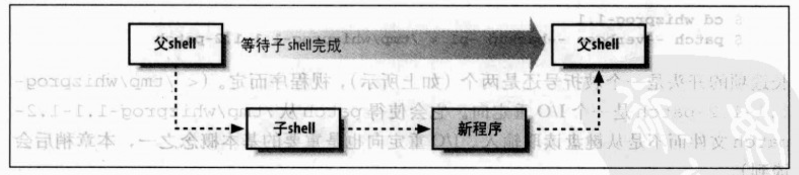

## 2.1 脚本变成语言与编译型语言的差异

编译型语言:</br>
好处: 高效
缺点: 多半运作于底层，所处理的时字节，证书，浮点数，或是其他机器层级的对象

脚本语言:</br>
通常是解释型，由解释器读入程序代码，并将其转换成内部的形式，再执行。

多半运行于比编译型语言还高的层级，能够轻易处理文件与目录之类的对象。缺点是效率比较低

## 2.2 为什么要使用shell脚本?

简单性:shell是一个高级语言，通过它可以简洁的表达复杂的操作。</br>
可移植性:使用POSIX定义的功能，可以做到脚本无需修改就在各个系统上运行。</br>
开发容易:可以在短时间内完成一个功能强大又好用的脚本。</br>

## 2.3 一个简单的脚本

```
$ cat > nusers            建立文件，使用cat复制终端的输入
who | wc -l               程序内容
^D                        Ctrl+D表示结束编辑
$ chomd +x nusers         让文件拥有执行的权限
$ ./nusers                执行文件
   6                      输出我们要的结果
```
* | (管道)符号可以在两个程序之间建立管道，一个程序的输入成为另一个程序的输出大大提高效率
* wc字符计算程序(line:行数,word字数,character字符数)

## 2.4 自给自足的脚本:位于第一行的 #！
* 在UNIX上有多个shell
* 在第一行的开头出使用#！这两个字符来告知UNIX内核使用哪个shell来执行脚本


## 2.5 Shell的基本元素

### 2.5.1 命令行参数

1. 以空白(Space或Tab键)隔开命令行中的各个组成部分
2. 以命令开头，后面通常跟着选项(option)，接着是参数(argument)
3. 选项以破折号(或减号)开头，后面接着一个字母(example:-l).
   * 选项是可有可无的
   * 有的后面可以需要参数(-o)，有的选项后面不需要(-l,-t)。
   * 如果不需要参数，则可以合并(-l,-t,合并为-lt).
   * 长选项以一个破折号还是两个，视程序而定(--verbose, --backup)
4. 分号(;)会分隔同一行的多条命令.Shell会依次执行.(cd work; ls -l whizprog.c)
5. 如果用&代替分号,Shell会在后台执行前面的命令。(这意味着，shell不用等待该命令执行完成就可以执行下一条命令)

Shell识别三种基本命令:

* 内建命令:由Shell本身所执行的命令。(cd, read等)
* Shell函数:是功能健全的一系列程序代码
* 外部命令:就是Shell的副本(新的进程)所执行的命令。如图



 
### 2.5.2 变量

```
first=isaac middle=bashevis last=singer 单行可进行多次赋值
fullname="isaac bashevis singer"        值中包含空格时，使用引号
oldname=$fullname                       此处不需要引号
fullname="$first $middle $last"         这里需要双引号
```

* 以字符或者下划线开头，后面跟字母,数字,下划线（长度无限制）
* 赋值方式: 变量名=值(等号两边无空格).(值内有空格时，把值加引号)
* 取值:在变量前加$符号

### 2.5.3 简单的echo输出

#### echo的相关定义:


echo输出时，会自动提供一个换行符。
#### echo的主要任务
  * 产生输出来提示用户
  * 或用来产生数据供进一步处理。

#### echo的转义序列


### 2.5.4 华丽的printf输出

```
$printf "The first program always prints: '%s, %s!'\n", Hello world
The first program always prints ':Hello word!'
```
* printf输出时，如果换行需要显式的指定\n
* printf语法: printf format-string [arguments...]

   ```
   第一部分是格式字符串(-s:字符串,-d:十进制整数)
   第二部分是参数列表
   详情见7.4节
   ```

### 2.5.5 基本的I/O重定向
#### 2.5.5.1 基本概念
+ 标准输入:数据的来源端</br>
+ 标准输出:数据的目的端</br>
+ 标准错误输出:报告问题的地方</br>
+ 默认的标准输入，标准输出，标准错误输出都是终端
+ I/O重定向:通过与终端交互或是在Shell脚本里设置，重新哪里输入，哪里输出。

#### 2.5.5.2 重定向与管道

- 以 < 改变标准输入

  ```
  program < file 可将program的标准输入改为file:
  tr -d '\r' < dos-file.txt
  ```
- 以 > 改变标准输出
  
  ```
  program > file 可将program的标准输出改为file:
  tr -d '\r' < dos-file.txt > UNIX-file.txt
  这条命令会先以tr将dos-file.txt中的回车符删除，然后将转换完成的数据输出到UNIX-file.txt中。dos-file.txt中的原始数据并没有改变。
  注意: > (重定向符)在目的文件不存在时创建，存在时覆盖。
  ```
- 以 >> 改变标准输出

  ```
  program >> file 可将program的标准输出附加到file结尾。
  
  for f in dos-file*.txt
  do
    tr -d '\r' < $f >> big-UNIX-file.txt
  done
  注意:>>在目的文件不存在时创建，存在时追加到文件结尾。
  ```
  
- 以 | 建立管道
  
  ```
  可将program1 | program2可将program1的标准输出改为program2的标准输入
  注意: 
  管道把多个执行程序衔接到一起
  管道可使执行速度比用临时文件快10倍
  ```

**tr的简单定义**


**注意:**

构建管道时，应该将数据变少的步骤放到前面

### 2.5.6 基本命令查找
+ shell会沿着$PATH来寻找命令
+ $PATH是一个以冒号分割的目录列表
+ 自定义目录加入到PATH路径下
   
   ```
   $ cd                    切换到home目录     
   $ mkdir bin             建立个人bin目录
   $ mv nusers bin         将我们的脚本放到该目录下
   $ PATH=$PATH:$HOME/bin  将个人的bin目录附加到PATH
   $ nusers                尝试执行
      6                    shell找到并执行
    
    注意: 
    要让修改永久有效，需要在.bash_profile中加入PATH=$PATH:$HOME/bin

   ```

## 2.6 访问Shell脚本的参数

- 位置参数(positional parameters)指的也就是命令行参数(command-line arguments).
- 各参数由整数来命名，当超过9时，用大括号括起来($1,$2...$(10)..$(n))

```
$ cat > finduser     建立新文件
#! /bin/sh           
# finduser 注释

who | grep $1
^D                   以end-of-file结尾

$ chmod +x finduser  设置执行权限
$ ./finduser betsy   执行并输入参数betsy
```
## 2.7 简单的执行跟踪

* set -x 打开跟踪(该命令不会被跟踪，因为是在该命令执行后，才打开跟踪的)
* set +x 关闭跟踪(该命令会被跟踪，因为是在该命令执行后，才关闭跟踪的)


