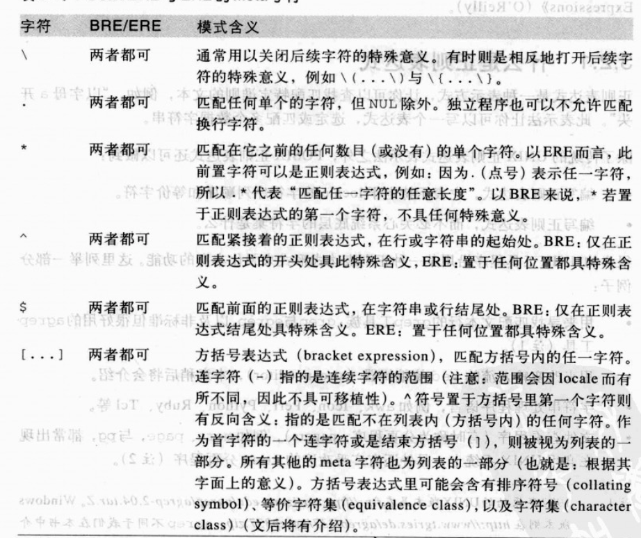
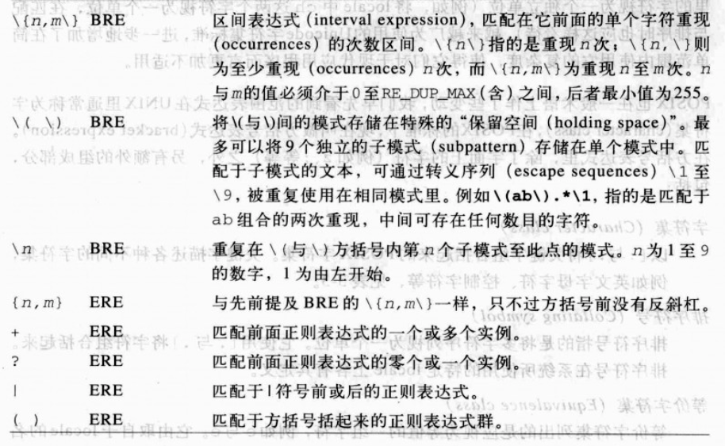
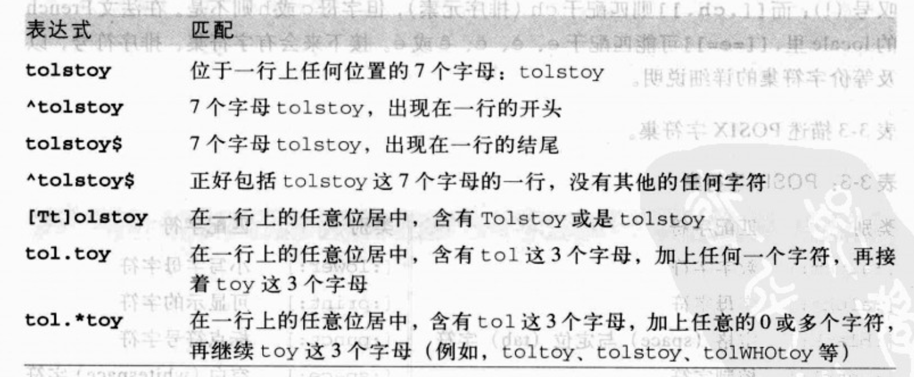
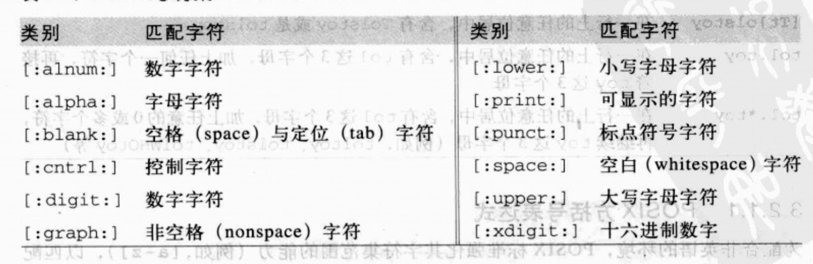
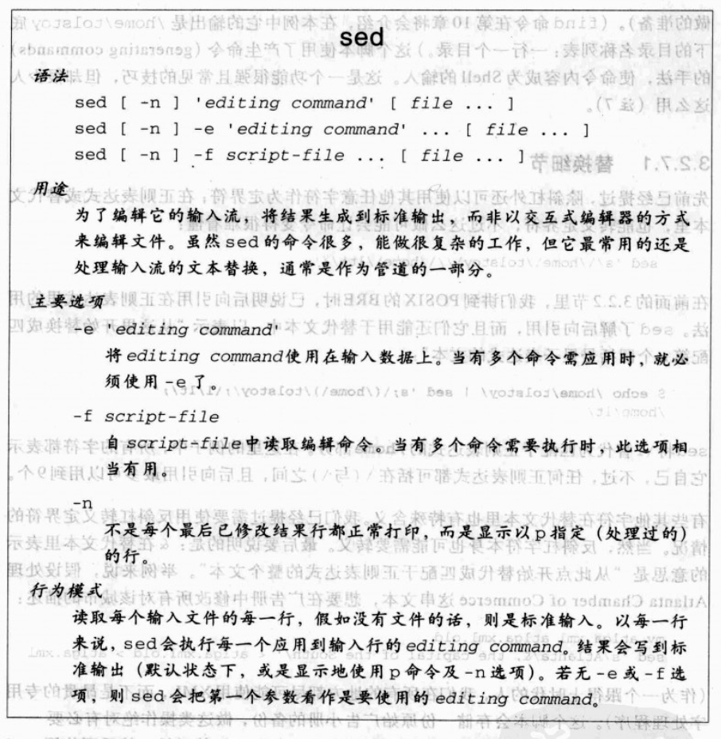
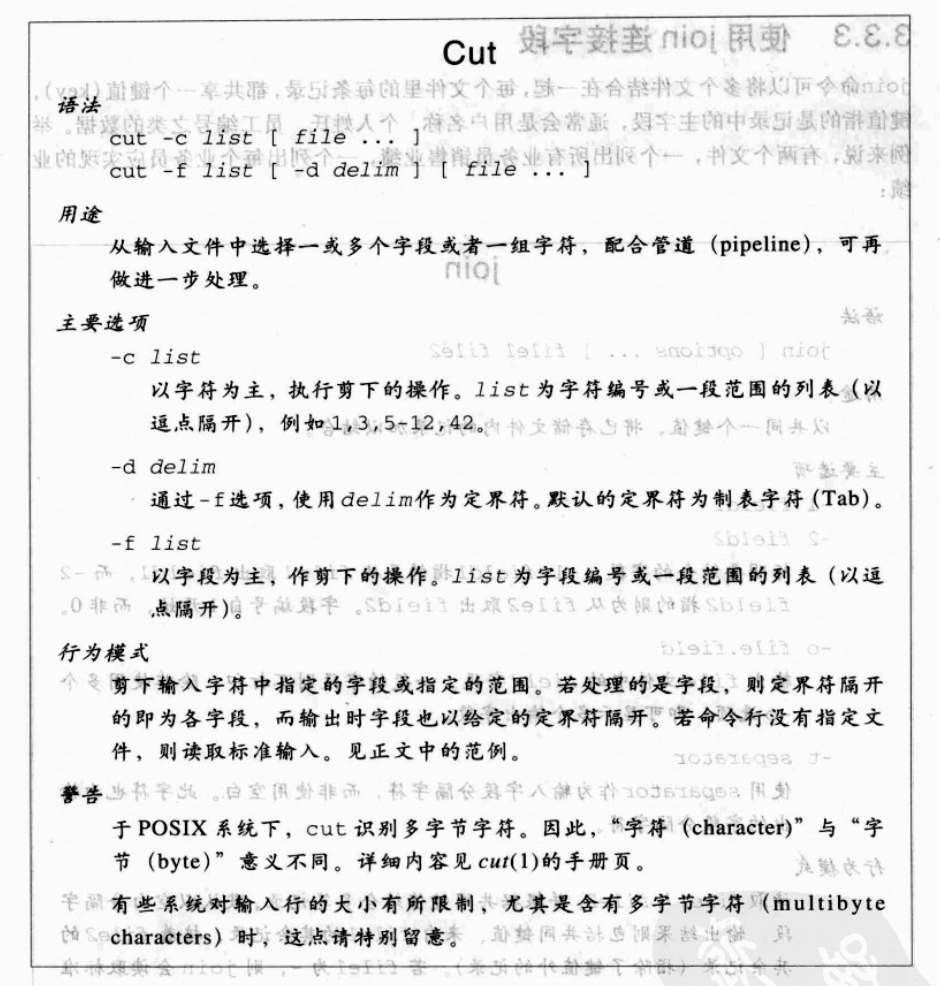
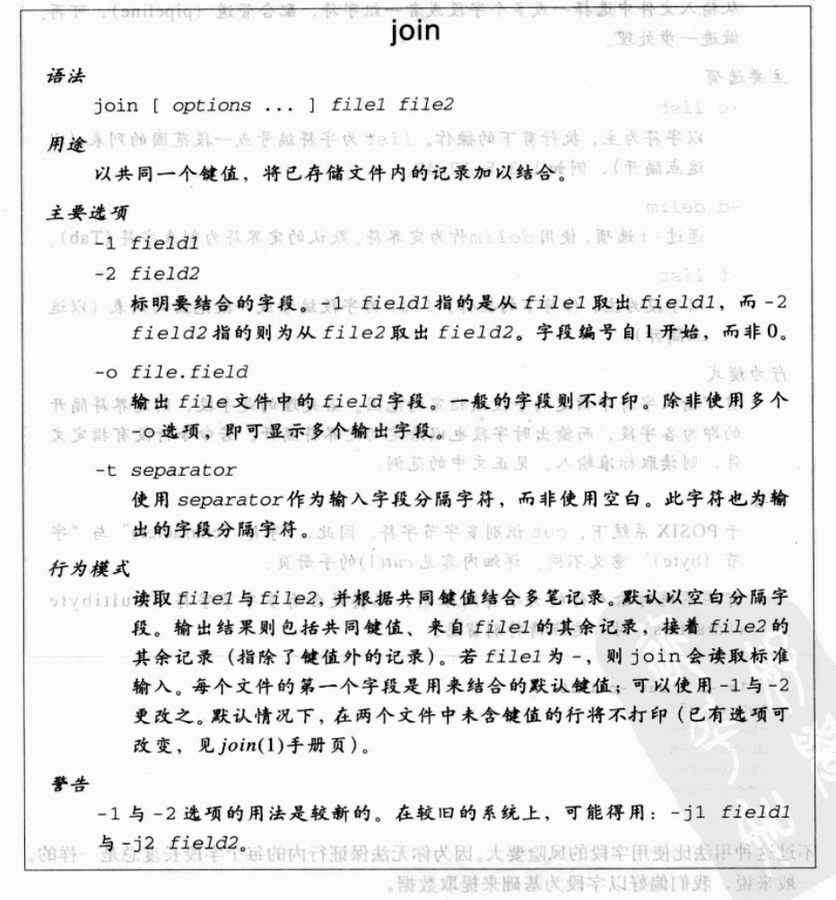

## 3.1 查找文本

传统上，有三种程序，可以用来查找整个文件:

- grep:最早的文本匹配程序，使用基本正则表达式(Basic Regular Expression, BRE);
- egrep:扩展式grep(Extended grep)，使用扩展正则表达式(Extended Regular Expression, ERE),功能更加强大;
- fgrep:快速grep(Fast grep)，用于配置固定字符串，而非正则表达式.使用了优化的算法，更高效。(grep,egrep只能匹配一个正则表达式，而fgrep可以匹配多个字符串)
- 最终三个版本被整合为grep，通过不同选项加以控制。
  
### 3.1.1 简单的grep

grep最简单的用法就是使用固定字符串:

```
$ who | grep -F austen
$ who | grep austen
只要grep是匹配固定的字符串(非正则),默认的行为模式就是-F.
```
## 3.2 正则表达式

grep的语法:

```
                        grep
 语法:
 
    grep [options...] pattern-spec [files...]  
     
 用途:
 
    匹配一个或多个模式的文本行.时常作为管道的第一步，以便对匹配的数据作进一步的处理。
    
 主要选项:
     
    -E
       使用扩展正则表达式进行匹配(grep -E取代egrep)
    -F
       使用固定字符串进行匹配(grep -F取代fgrep)
    -e pat-list
       模式以减号开头时，grep会把它当做选项。而-e，可以指定其参数为模式--即便是它以减号开头。
    -f pat-file
       从pat-file文件读取模式作匹配
    -i 
       模式匹配时，忽略大小写差异
    -l 
       列出匹配模式的文件名称,而不是打印匹配的行
    -q
       静默的。如果模式匹配到，则grep会成功的离开，而不将匹配的行写入标准输出.
    -s 
       不显示错误信息。通常与-q并用
    -v
       显示不匹配模式的行.
     

行为模式
    读取命令行上指定的每个文件。发现匹配查找模式的行时，将它显示出来。当指明多个文件时，grep会在每一行前面加上文件名与一个冒号.默认使用BRE.    
                     
警告  
    你可以使用多个-e与-f选项，建立要查找的模式列表.                   

```

### 3.2.1 什么是正则表达式?
* `POSIX BRE`与`ERE`的元字符(meta character)列表 (可移植操作系统接口 Portable Operating System Interface of UNIX，缩写为 POSIX ）




* 下表列举了一些例子




#### 3.2.1.1 POSIX方括号表达式

+ POSIX字符集



### 3.2.2 基本正则表达式


#### 3.2.2.1 匹配单个字符

以一般字符，以转义的meta字符，以`.`meta字符,或是用方括号表达式来进行匹配。

#### 3.2.2.2 向后引用

* BRE提供了一种向后引用的机制。使用`\digit`,来重复先前出现的`\(与\)`子表达式 
  + `digit`范围为`1~9`
  
```
例如

模式                               匹配成功
\(ab\)\(cd\)[def]*\2\1            abcdcdab, abcdeecdab等
\(why\).\1                         一行里出现两个why
\([[:alpha:]_][:alnum:]_*\) = \1; 简易C/C++赋值语句
\(["']\).*\1                      匹配以单引号或双引号括起来的数字
                                  (无须担心是单引号还是双引号先找到)
  
```

#### 3.2.2.3 单个表达式匹配多字符

+ `ab` 匹配`ab`
+ `..` 匹配任意两个字符
+ `[[:upper:]][[:lower:]]`匹配任意一个大写字符，后面接着任意一个小写字符
+ `*`匹配0个或多个前面的单个字符。ab*c表示匹配一个a,0个或多个b，以及一个c.
   - 例如: `ac`,`abc`,`abbc`,`abbbc`等
+ `\{n\}`前置表达式所得结果重现n次。
   - 例如: 重现5个a , `a\{5\}`
+ `\{n,\}`前置表达式所得结果重现至少n次。
+ `\{n,m\}`前置表达式所得结果重现n到m次。
  - 例如: 重现5到20个a , `a\{5,20\}`

#### 3.2.2.4 文本匹配锚点

* `^`和`$`叫做锚点(anchor),用于针对被匹配的字符串的开始或结尾进行匹配。
* `^`或`$`只在表达式开头或结尾具有特殊含义，在中间时表示其本身。

#### 3.2.2.5 BRE运算符优先级

BRE运算符优先级,由高到低

```
运算符             表示意义
[..] [==] [::]    用于字符排序的方括号符号
\metacharacter    转义的meta字符
[]                方括号表达式
\( \) \digit      子表达式与后向引用
* \{ \}           前置单个字符重新的正则表达式
无符号             连续
^ $               锚点
```

### 3.2.3 扩展正则表达式ERE

#### 3.2.3.1 匹配单个字符

与BRE基本一致，其他暂时不用考虑

#### 3.2.3.2 后向引用不存在

在ERE中无后向引用

#### 3.2.3.3 匹配单个表达式与多个正则表达式

* `?` 匹配0个或一个前置正则表达式
* `+` 匹配1个或多个前置正则表达式

#### 3.2.3.4 交替

* 方括号表达式易于表示`匹配于此字符，或其他字符，或...`,但不能指定匹配`这个序列，或是其他序列，或...`
* 交替运算符`|`(又名管道字符),指定匹配`这个序列，或是其他序列，或...`.例如，`read|write`,匹配于read或write。其优先级最低。
*

#### 3.2.3.5 分组

* `()`提供分组功能. `(why)+`匹配于一个或连续重复的多个why.

#### 3.2.3.6 停驻文本匹配

* `^`, `$`表示的意义和BRE里相同。
* 但是在ERE中,像`ab^cd` 与`ef$gh`这样的正则表达式还是`^`,`$`还是meta字符，只不过不能匹配到任何文本。而在BER中`ab^cd` ,`ef$gh`的` ^`, `$`已经不是meta字符，只代表其本身。

#### 3.2.3.7 ERE运算符的优先级

ERE运算符优先级，由高到低

```
运算符                           含义
[..] [= =] [: :]              用于字符对应的方括号符号
\metacharacter                转义的meta字符
[]                            方括号表达式
()                            分组
* + ? {}                      重复前置的正则表达式
无符号 (no symbol)             连续字符
^ $                           锚点
|                             交替

```

### 3.2.4 正则表达式的扩展

额外的GNU正则表达式运算符

```
运算符      含义
\w         匹配任何单词组成字符，等同于[[:alnum:]_]
\W         匹配任何非单词组成字符，等同于[^[:alnum:]_]
\<\>       匹配任何单词的起始与结尾
\b         匹配任何单词起始或结尾处所找到的空字符串
\B         匹配两个单词组成字符之间的空字符串
\'  \`     分别匹配GNU程序或emacs缓冲区的开始与结尾
```


### 3.2.5 程序与正则表达式

xxxxxxxxxxxxx

### 3.2.6 在文本文件里进行替换

* `sed`流编辑器程序执行文本替换

### 3.2.7 基本用法



1. 用替代文本替换匹配文本

```
sed 's/:.*//' /etc/passwd |  删除第一个冒号之后的东西
  sort -u                    排序列表并删除重复的部分

```

 * 在这里`/字符`是定界符，分隔正则表达式与替代文本。替代文本为空时，会删除匹配文本。


2. `/`是常用的定界符,但是任何可现实的字符都能作为定界符.


```
find /home/tolstoy -type d -print   | 寻找所有目录
  sed 's;/home/tolstoy/;/home/lt/;' | 修改名称;注意:这里使用分号作为定界符
   sed 's/^/mkdir /'                | 插入mkdir命令
     sh -x                            以shell跟踪模式执行

```


##### 3.2.7.1 替换细节

此时，暂不了解

### 3.2.8 sed的运作

* sed的工作方式相当直接,命令行上的每个文件名会依次打开与读取.如果没有文件，则使用标准输入，文件名`-`可用于表示标准输入。
* sed读取每个文件，依次读取一行。
* 每个读取的行，放到模式空间(内存的一个区域),所有操作完成的模式空间的内容被打印到标准输出。然后接着读取下一行。


#### 3.2.8.1 打印与否

* `-n`选项使sed不会在操作完成后打印模式空间的内容
* `-p`选项使sed在操作完成后打印模式空间的内容

### 3.2.9 匹配特定行

* sed可以限制一条命令应用到哪些行，只要在命令前置一个地址即可.


### 3.2.10 有多少文本会改动

用到时，具体了解

###  3.2.11 行v.s字符串

* grep,egrep,sed等,^与$分别表示行的开头与结尾
* awk, Perl，Python，^与$分别表示字符串的开头与结尾

## 3.3 字段处理

一条记录可理解为记录若干字段数据的集合。

### 3.3.1 文本文件惯例

* 在文本文件中，一行表示一条记录。
* 一行内用来分隔开不同的字段的两种惯例
  + 空格键或tab键
  + 用特定的定界符来分隔开不同字段，例如冒号.

### 3.3.2 使用cut选定字段

* cut命令是用来剪下文本文件里的数据




### 3.3.3 使用join连接字段

* join命令可以将多个文件结合在一起，每个文件里的每条记录都共享一个键值。



合并下列两个文件中的数据

```
$ cat sales
# 业务员数据
# 业务员   量
joe       100
jane      200
herman    150
chris     300


$ cat quotas
# 配额
# 业务员  配额
joe      100
jane     200
herman   150
chris    300

建立 merge-sales.sh

#! /bin/sh

# 删除注释并排序数据文件
sed '/^#/d' quotas | sort > quotas.sorted
sed '/^#/d' sales  | sort > sales.sorted

# 以第一个键值作结合，将结果产生至标准输出
join quotas.sorted  quotas.sorted

# 删除缓存文件
rm quotas.sorted quotas.sorted

***********
执行脚本后结果

chris   95  300
herman  80  150
jane    75  200
joe     50  100

```


### 3.3.4 使用awk重新编排字段


#### 3.3.4.1 模式与操作

* awk读取命令行上指定的各个文件，若无，则读取标准输入
* 一次读入一条记录(行)
* 然后针对每一行，应用程序所指定命令
* 基本架构: awk `pattern {action}`.若匹配`pattern`则执行`action`.

#### 3.3.4.2 字段

* awk读取输入记录，然后自动将各个记录切分为字段
* awk将每条记录内的字段数目，存储到内建变量NF

使用字段

```
awk '{ print $1}'           打印第1个字段 (未指定pattern)
awk '{ print $2, $5}'       打印第2个与第5个字段 (未指定pattern)
awk '{ print $2, $NF}'      打印第2个与最后一个字段 (未指定pattern)
awk 'NF > 0 { print $0}'    打印非空行(指定pattern与action)
awk 'NF> 0'                 同上 (未指定action，则默认为打印)
```

+ 特别注意 => 编号0:表示整条记录


#### 3.3.4.3 设置字段分隔字符

* awk的输入，输出分隔字符用法是分开的
 +  使用`-F`选项修改字段输入分隔字符. -F自动设置`FS`变量。
   `awk -F: '{print $1, $5}' /etc/passwd`,此时打印出的内容仍然是以空格作为分隔符
 +  使用`-v`选项修改字段输出分隔字符.但必须手动设置`OFS`变量。
    `awk -F: -v 'OFS=**' '{print $1, $5}' /etc/passwd`，此时打印出的内容以`**`作为分隔符

#### 3.3.4.4 设置字段分隔字符

awk的的打印会自动提示换行符

#### 3.3.4.5 起始与清除

了解一下

* BEGIN与END这两个特殊模式，提供了awk程序的起始和清除

```
BEGIN    {起始操作程序代码}
pattern1 {action1}
pattern2 {action2}
END      {清除操作程序代码}

$ awk 'BEGIN { FS= ":" ; OFS = "**" }

```