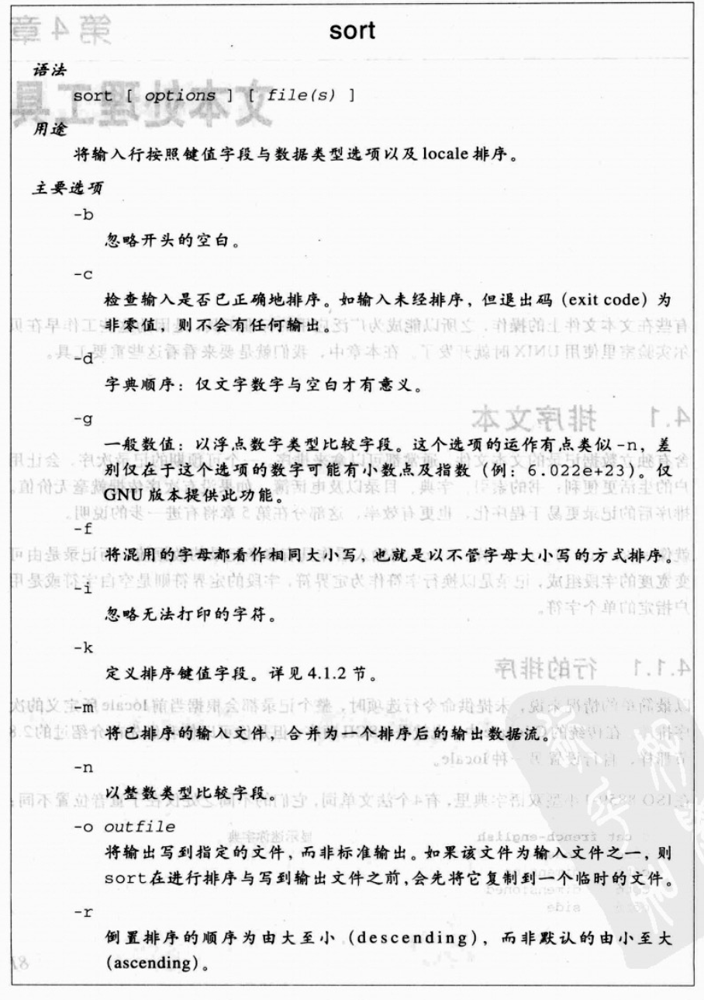
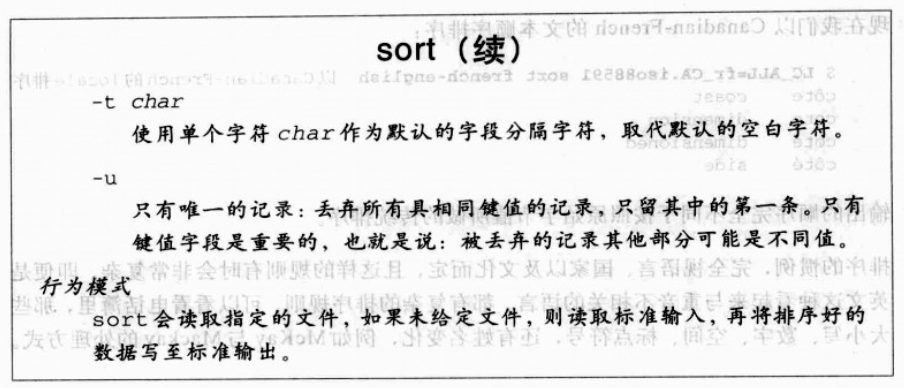
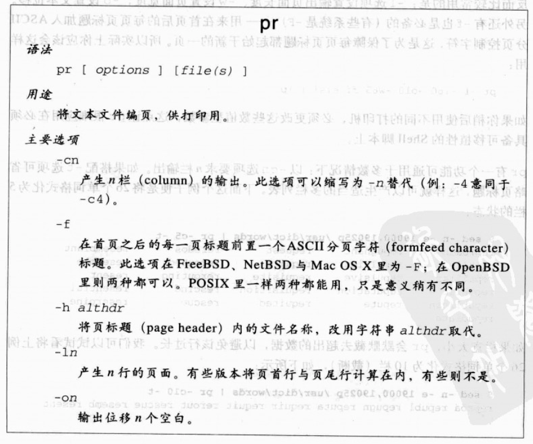
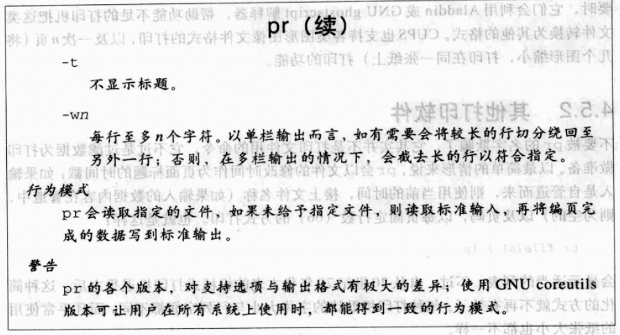

## 4.1 排序文本

含有独立数据记录的文本文件，通常都可以拿来排序

### 4.1.1 行的排序




### 4.1.2 以字段排序


 * `-k`选项指定排序字段, `-t`选项选择字段定界符
    + `-k`选项的后面接着一个字段编号,或是一对数字，有时在-k之后可用空白符
    + 未指定`-t`时，表示字段以空白分隔，且记录内开头和结尾的空白被忽略
    + 指定`-t`时，空白字段也是有意义的。（即使-t后面指定的分隔符为空白，此时记录内的空白也是有意义的。？？？）

 
 排序键值字段的类型
 
 ```
 字母          说明
 b            忽略开头的空白
 d            字典顺序
 f            不区分字母的大小写
 g            以一般的符点数字进行比较，只适用于GNU版本
 i            忽略无法打印的字符
 n            以数字比较
 r            倒置排序的顺序 
 ```
 
* 字段以及字段里的字符都是由1开始. 下面列举一些排序的情况
 
 1. 如果仅指定一个分段编号，则排序键值会自该字段的起始处开始比价，一直到记录的结尾结束比较
     + `sort -t: -k1 /etc/passwd`,以:为分隔符，从第一个字段开始排序
     
     ```
      bin:x:1:1:bin:/bin:....
      chico:x:12501...
      daemon:x:2:2
     ```
 2. 如果给的是一对用逗号隔开的字段数字，则排序键值将由第一个字段值的起始处开始比较，到第二个字段值的结尾结束比较
     + `sort -t: -k1,2 /etc/passwd`,以:为分隔符，从第一个字段开始比较,到第二个字段结束比较
     
 3. 如果使用的是点号字符位置，则从第一对数字表示的位置开始到第二对数字表示的位置结束
     + `sort -t: -k2.4,5.6 /etc/passwd`,以:为分隔符，从第二个字段的第4个字符开始比较,到第五个字段的第六个字符结束比较。

 4. 如果一个排序键值的起始正好落在记录的结尾处之后，则排序键为空，且空的排序键值在排序时将优于所有非空的键值
 5. 当出现多个-k时，则先用第一个键值字段进行排序，然后用匹配后的记录，再进行第二个键值字段的排序，以此类推。

* 反向排序
 
 例如 `sort -t: -k1nr /etc/passwd`, 以第一个字段进行反向排序
 
  ```
      daemon:x:2:2
      chico:x:12501...
      bin:x:1:1:bin:/bin:....
  ``` 
 
### 4.1.3 文本块排序

用到时，再具体了解

### 4.1.4 sort的效率

当数据量n非常大时，冒泡排序，插入排序几乎会让数据增加到n2的平方那么大。而幸运的是，已经有很多有效率的算法，例如nlogn,n的分布排序等等

### 4.1.5 sort的稳定性

例如以第一个键值和第二个键值进行排序

```
sort -t_ -k1,1 -k2,2 << EOF
> one_two
> one_two_tree
> one_two_four
> one_two_five
> EOF

one_two
one_two_five
one_two_four
one_two_tree
```

* 此时在各个字段中键值`one,two`是相同的，但是输出的顺序却与我们输入的顺序不同，这个时候我们说sort不稳定。
* GNU可以通过`--stable`选项解决这个问题.


## 4.2 删除重复

有时，将数据流里的连续重复的记录删除是有必要的。

* `sort ... | uniq | ...`,利用`uniq`命令删除排序后重复的记录
* `uniq`的选项:`-c`该行重复的次数。 `-d`仅显示重复的行，`-u`显示未重复的行

uniq的使用
```
$ cat latin-numbers  显示测试文件
tres
unus
duo
tres
duo
tres

$ sort latin-numbers | uniq  显示唯一的，排序后的记录，并删除重复
duo
tres
unus

$ sort latin-numbers | uniq -c 显示重复的次数
2 duo
3 tres
1 unus

$ sort latin-numbers | uniq -d 仅显示重复的记录
duo
tres

$ sort latin-numbers | uniq -u 仅显示未重复的记录
unus
```


## 4.3 重新格式化段落

* `fmt -s`切割较长的行，但不会将短行结合成较常的行
* `fmt -w n`设置输出行宽度为n个字符

## 4.4 计算行数，字数以及字符数

* `wc`字数计算工具。
* `-c`选项计算字节数
* `-l`选项计算行数
* `-w`选型计算字数

## 4.5 打印 (暂做了解)

打印的命令

```
命令      用途
lp       传送文件到打印队列
cancel   从打印队列删除文件
lpstat   报告队列状态

```

### 4.5.1 打印技术的演化

。。。。。。一些历史 。。。。。

### 4.5.2 其他打印软件

pr并不是打印命令，而是用来过滤数据为打印做准备。





* `-l` 设置输出页面的长度
* `-w` 设置输出页面的宽度
* `-o` 设置文本位移

## 4.6 提取开头或结尾数行

* 显示开头的数行
  + head -n n [file(s)]
  + head -n [file(s)]
  + aws 'FNR <= n' [file(s)]
  + sed -e nq [file(s)]
  + sed nq [file(s)]
  
* 显示结尾的数行

  + tail -n n [file]
  + tail -n [file]

  
```
设置-f状态后，tail只有当通过Ctrl-C才能中断。否则休息一秒后重复执行。
$ tail -n 25 -f /var/log/messages 观察不断成长的系统日志
...
^C                                Ctrl-C停止tail

```
