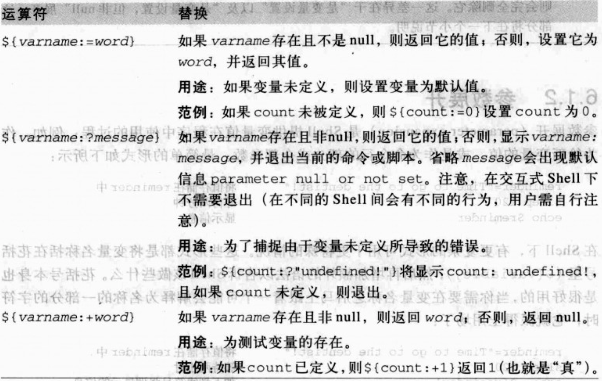
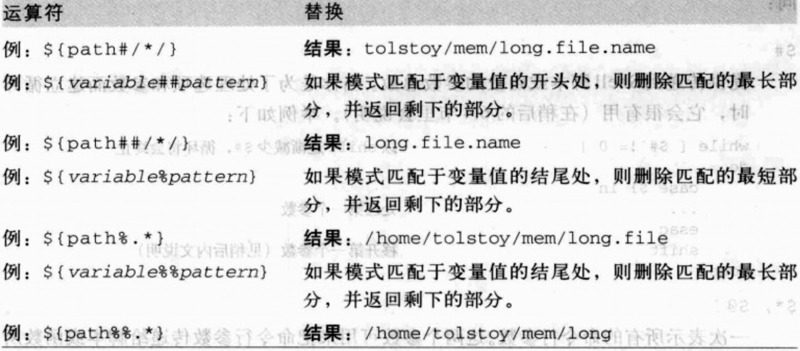

## 6.1 变量与算术

> 同传统程序语言的变量一样，是用来保存某个值

### 6.1.1 变量赋值与环境


* 命令`export` 可将变量放进环境变量里
   + 环境是一个名称与值的简单列表，可供所有执行终端额程序使用
   + 新的进程会从其父进程继承环境，也可以在建立新的子进程之前修改它   
   
       ```
       例如:export命令将新变量添加环境中
       PATH=$PATH:/usr/local/bin 更新PATH
       export PATH               导出它
       或合在一起
       export  PATH=$PATH:/usr/local/bin 
    
       ```
      
   
   + `export -p`显示当前环境
     
     ```
     typeset -x GEM_HOME=/Users/liuhuajian/.rvm/gems/ruby-2.4.0
     typeset -x GEM_PATH=/Users/liuhuajian/.rvm/gems/ruby-2.4.0:/Users/liuhuajian/.rvm/gems
     ruby-2.4.0@global
typeset -x HOME=/Users/liuhuajian
     .....
     ```
   + 仅仅针对当前命令改变环境中PATH的值
      
      - `PATH=/bin:/usr/bin awk '...' file1 file2`
 
* readonly 使变量无法被修改
   
   + `readonly hours_per_day = 24 `
       
 
 
* `env`可用于从程序的环境中删除变量
    + `env -i PATH=$PATH HOME=$HOME LC_ALL=C awk '...' file1 file2`
       
      - `-i`选型用来初始化环境变量的。也就是丢弃任何继承值，仅传递命令行上指定的变量给程序使用

 
 
* `unset`命令从执行中的shell中删除变量与函数
   
    + 删除变量
    
      ```
      默认设置以及-v选项都会删除变量
      unset full_name    删除full_name变量
      unset -v first middle last 删除first， middle, last变量
      ```
      
    + 删除函数
    
       ```
       who_is_on (){                          定义函数
           who | awk '{ print $1}' | sort =u  产生排序后用户列表
       }
       ....
       unset -f who_is_one                    删除函数
       ```
       
### 6.1.2 参数展开
> 参数展开是Shell提供变量值在程序中使用的过程

 
#### 6.1.2.1 展开运算符

##### 替换运算符




* 上面的图中的运算符的`:`都是可选的.如果省略冒号，则将每个定义中的`存在且非null`改为`存在`.


##### 模式匹配运算符

在下面的例子中，假设path的值为<br/>
`/home/tolstoy/men/long.file.name`




* `#` 匹配开头， `##` 匹配开头且是贪婪匹配
* `%` 匹配结尾， `%%` 匹配结尾且是贪婪匹配
* `${#variable}`返回`${variable}`值的字符串的长度

#### 6.1.2.2 位置参数

> 位置参数指的是Shell脚本的命令行参数<br/> 
> 同时也表示在Shell函数内的函数参数<br/> 
> 参数形式: `$1 $2 ....$9 ... ${10}, ${n}`

* 特殊变量提供了对传递的参数的总数的访问，以及一次对所有参数的访问

  ```
$# 提供了传递打Shell脚本或函数的参数总的数量
$*或$@ 把所有命令行参数传递给脚本或函数内执行的程序
"$*" 将所有命令行参数视为单个字符串。等同于"$1 $2 ...".
"$@" 将所有命令行擦书视为单独的个体。等同于"$1" "$2"...它会保留所有内嵌在每个参数里的任何空白

 shift命令用来`截去`来自列表的位置参数，从左边开始。一旦执行shift，  
 $1值会消失，后面的所有的值向左边移动一位。

  set -- var1 var2 var3 --会结束选项部分，自var1设置新的位置参数
   ```

  示例
  
   ```
   1. set用法:
   $ set -- hello "hi there" greetings    设置新的位置参数
   $ echo there are $# total arguments    显示基数值
   
   there are 3 total arguments
   
   2. $*用法:
   
   $ for i in $*        循环处理每一个参数
   > do echo i is $i
   > done  
   
   i is hello           注意，内嵌的空白已消失
   i is hi
   i is there
   i is greetings 
   
   3. $@用法:和$*一样
   
   $ for i in $@        循环处理每一个参数
   > do echo i is $i
   > done  
   
   i is hello            注意，内嵌的空白已消失
   i is hi
   i is there
   i is greetings 
   
   
   4. "$*"用法:
   
   $ for i in $*        加了双引号，$*表示一个字符串
   > do echo i is $i
   > done  
   
   i is hello  hi there greetings
   
   5. "$@"用法:
   
   $ for i in $@        加了双引号，$@ 保留真正的参数值
   > do echo i is $i
   > done 
   
   i is hello            
   i is hi there
   i is greetings 

   
   6. shift用法: 截去第一个参数
   
   $shift                            截去第一个参数 
   $echo there are now $# arguments  
     
   there are now 2 arguments
   
   $ for i in "$@"
   > do  echo i is $i
   > done
   i is hi there                     原本的第一个参数内容已消失
   i is greetings     

   ```

#### 6.1.2.3 特殊变量

> 下表列举了一些POSIX内置的特殊Shell变量


#### 6.1.3 算术展开

> 下表列举了支持的运算符，优先级从最高到最低
> 它们都置于`$((...))`语法中.除了内嵌双引号其他无需转义


## 6.2 退出状态

> 程序退出状态:每一条命令执行完退出时，都会返回一个整数值给引用它的程序


### 6.2.1 退出状态值

* 退出状态为0时表示命令执行成功
* `$?`显示上次执行的命令的退出状态

#### POSIX的结束状态

```
值         意义
0          命令成功退出
>0         在重定向或单词展开期间(失败
1-125      命令不成功的退出。特定的退出值的含义，是由各个单独的命令定义的
126        命令找到了，但文件无法执行
127        命令找不到
>128       命令因收到信号而死亡

```

#### exit命令


### 6.2.2 if-elif-else-fi语句

> 语法格式

```
if 条件1
  then 
   statements-if-true-1
elise 条件2
  then
   statements-if-true-2
...

else 
  statements-if-all-else-fail
  
 fi
 
 如果条件1为真，执行statements-if-true-1，并退出。否则，判断条件2，如果条件2为真，执行statements-if-true-2，并退出。...否则，最终执行statements-if-all-else-fail,然后退出。
 
整个if...fi的状态，即为最后一条命令执行时的状态.
```

### 6.2.3 逻辑的NOT,AND与OR

运算符`！`, `&&` ,`||`，跟普通程序意义一样。

### 6.2.4 test命令

> test的基本语法


> test的主要选项


> 简单示例：判断某个文件是字符串是否非null

  ```
  $ test "$str1" 或 $ [ "$str1" ]
 
  ```
  
## 6.3 case语句

过于简单

## 6.4 循环

### 6.4.1 for循环

> 基本语法

```
for ... in ...
do
...
done

```

### 6.4.2 while与until循环

> 基本语法

```
1. while: 当condition成功退出时，继续循环。否则，退出循环
while condition
do 
  statements
done


2. until: 当condition未成功结束时，继续循环。否则，退出循环
until condition
do 
  statements
done 

```

### 6.4.3 break与continue

过于简单

### 6.4.4 shift与选型的处理

> shift:用来处理命令行参数，一次向左位移一位。删除$1原来的值，并使$2的值移到$1中，依次类推.


#### getopts命令


### 6.5 函数

函数指一段单独的程序代码。

无返回值

```
wait_for_user () {
  until who | grep "$1" > /dev/null
  do 
     sleep $(2, -30)
  done
}

```


