***

本章将完整的介绍Shell语言

***

### 7.1 标准输入，标准输出与标准错误输出

+ 标准输入:即程序的数据来源
+ 标准输出:即程序的数据出口
+ 标准错误输出:即程序的报告问题的地方

### 7.2 使用read读取行

> read命令是将信息传递给shell程序的重要方式之一

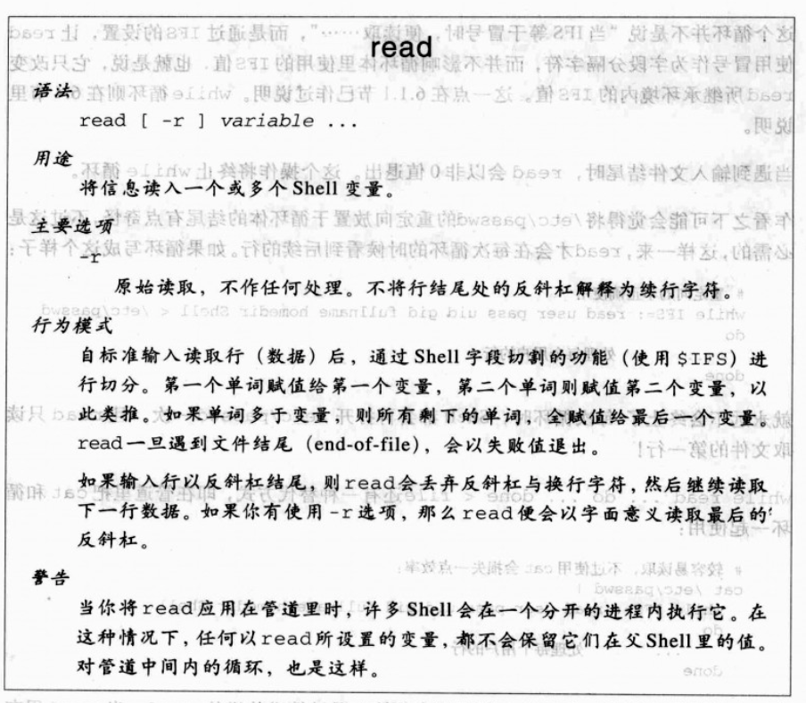

1. `while read ... do ... done < file` 把file的每一行内容读入进行处理，直到遇到文件结尾时，read会以非0值退出
2. 任何命令都能用来将输入通过管道传递给read
    + `cat file | while read ... do ... done`
    + `sed xx | while read ... do ... done` 
    + ...

3. `read`默认`\`作为续行的符号，`-r`选项忽略续行符`\`

   ```
   1. read默认\作为续行的符号
   
   $ printf "Enter name, rank, serial number:"; read name rank serno
   Enter name, rank, serial number: Jones \
   > Major \
   > 123-45-6789
   $ printf "Name: %s, Rank: %s, Serial number: %s\n" $name $rank $serno
   Name: Jones, Rank: Major, Serial number: 123-45-6789
   
   2. -r选项忽略续行符\

   $ read -r name rank serno
   tolstory \
   $ echo $name $rank $serno
   tolstory \ 
   
   此时name为tolstory，rank为\, serno没有值
   
   ```
 
### 7.3 关于重定向

> 我们已经介绍过基本的重定向运算符:`<`,`>`,`>>`,`|`<br/>
> 本节继续介绍其他的重定向运算符，以及文件描述符(file-descriptor)的处理


#### 7.3.1 额外的重定向运算符

1. `set -C`打开Shell所谓的禁止覆盖(noclobber)选项，当它在打开状态下时，单纯的>重定向遇到目标文件已存在时，就会失败。 >|运算符可令noclobber选项失效。
2. 提供行内输入的`<<`与`<<-`。`program << delimiter`可以在Shell脚本正文内提供输入数据。
3. 以`<>`打开一个文件作为输入与输出之用。使用`program <> file`。 `<`以只读模式打开文件，`>`以只写模式打开文件. `<>`以读写模式打开文件。

#### 7.3.2 文件描述符处理

1. 文件描述符(file descriptors):表示每个进程的打开文件
2. 从传统上文件描述符从0到9。
3. 文件描述符0,1,2 分别对应标准输入，标准输出，标准错误输出
4. 改变程序的标准输入，标准输出，标准错误输出
  + `make 1> results 2> ERRS` 改变make的标准输出到results文件和标准错误输出到ERRS文件
  + `make > results 2> ERRS` 与上面意义相同
  + `make 1> results 2> /dev/null` 改变make的标准输出到results文件,舍弃错误信息
  + `make > results 2>&1` 改变make的标准输出和标准错误输出都到results文件

##### exec命令

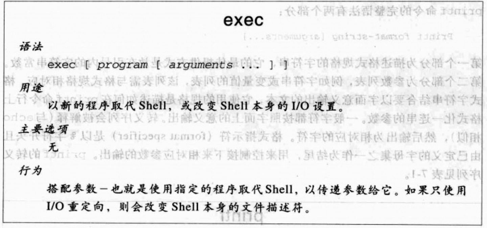

* 如果只有I/O重定向而没有任何参数，exec命令改变Shell的文件操作符，改变本身的I/O设置

  ```
  exec 2> /tmp/$0.log 重定向shell本身的标准错误输出
  exec 3< /some/file  打开新文件描述符3
  ...
  read name rank serno < &3 从该文件读取
  ```
  
* 如果有参数，则在当前shell下执行指定的程序
  
  ```
  exec real-app -q "$qargs" -f "$fargs" 执行程序
  
  exec为单项操作:控制权不可能会回到脚本。除非新程序无法被调用。
  ```

### 7.4 printf的完整介绍

* 命令语法: `Printf format-string [arguments...]`
  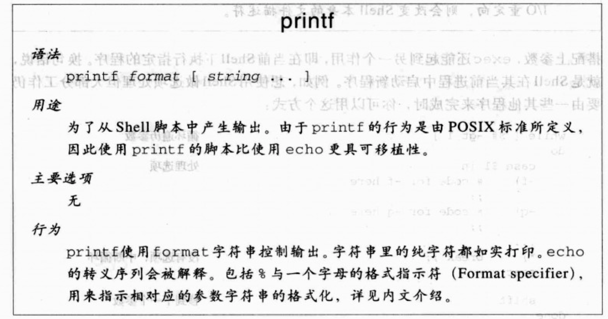
  
* printf的转义序列
  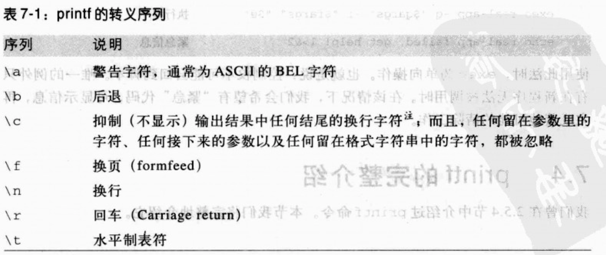
  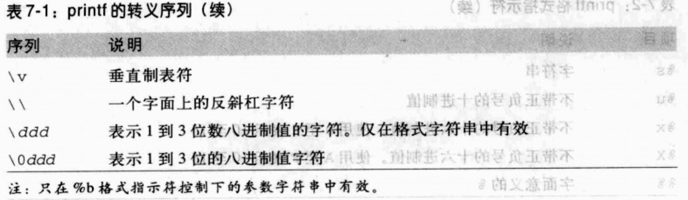
  
  + 默认情况下，只有格式字符串会被特别对待
   
     ```
     $printf "a string, no processing: <%s> \n" "A\nB"
     a string, no processing: <A\nB>
     ```
  + 当使用%b格式指示符时，printf会解释参数字符串里的转义序列
    
     ```
     $printf "a string, with processing: <%b> \n" "A\nB"
     a string, no processing: <A
     B>
     ```
* printf格式指示符
  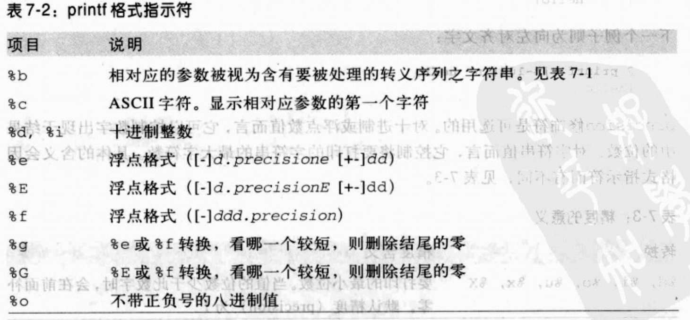
  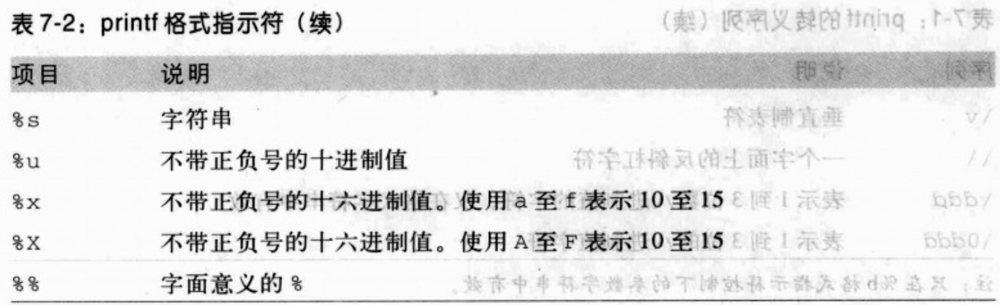
  
  + 默认是右对齐，`-`标志可以让字符串向左对齐
  
     ```
     10个字符宽度，右对齐
     $printf "|%10s|\n" hello
     |         hello|
     
     10个字符宽度，左对齐
     $printf "|%-10s|\n" hello
     |hello         |
     ```
     

## 7.5 波浪号展开与通配符

> Shell有两种与文件名相关的展开
> 第一个:`波浪号展开`
> 第二个:`通配符展开`或叫`全局展开`或叫`路径展开`


### 7.5.1 波浪号展开

```
$vi ~/.profile          与vi $HOME/.profile
$vi ~tolstoy/.profile   编辑用户tolstoy的.profile文件 
```

### 7.5.2 使用通配符


#### 基本通配符

```
通配符        匹配
？           任何的单一字符
*            任何的字符字符串
[set]        任何在set里的字符
[!set]       任何不在set里的字符    

[abc]        a,b或c
[.,;]        句号，逗号或分号
[-_]         破折号或下划线
[a-c]        a,b或c
[a-z]        任何一个小写字母
[!0-9]       任何一个非数字字符
[0-9!]       任何一个数字或惊叹号
[a-zA-Z]     任何一个小写或大写字母
[a-zA-Z0-9_-]任何一个字母，数字,下划线或破折号

echo .*      显示当前文件夹下的所有隐藏文件
   
```

### 7.6 命令替换

> 命令替换是指Shell执行命令将命令替换部分替换为执行该命令后的结果

* 第一种:使用反引号将要执行的命令框起来

  ```
  $ echo outer 	`echo inner1 \`echo inner2\` inner1` outer
  outer inner1 inner2 inner1 outer
  
  1. 反引号中的echo inner2执行完的结果inner2,替换掉echo inner2，此时反引号中的命令为echo inner1 inner2 inner1
  2. 反引号中的命令为echo inner1 inner2 inner1执行完结果为inner1 inner2 inner1，替换掉echo inner1 inner2 inner1
  3. 此时执行echo outer inner1 inner2 inner1 outer
 
  ```
  
* 第二种：将命令放在`$()`里
  
   ```
   $ echo outer 	$(echo inner1 $(echo innner2) inner1) outer
   outer inner1 inner2 inner1 outer
   ```
   
### 7.6.1 为head命令使用sed

`head -n 10 /etc/passwd` 显示文件的前10行

### 7.6.2 创建邮件列表

用到的时候，再做了解

### 7.6.3 简易教学: expr

用到的时候，再做了解

### 7.7 引用

> 引用是用来防止Shell将某些你想要的东西解释成不同的意义。(例如使用*或？的原义时)

1. 反斜杠转义`\`
   
    ```
    字符前置反斜杠(\),告知shell该字符为其字面的意义
    
    $ echo here is a real start: * and a real mark: \?
    here is a real start: * and a real mark: ?
    ```

2. 单引号`''`

     ```
     单引号强制shell将一对引号之间的所有字符都看作其字面意义
     
     $ echo 'here are some metacharacters: * ? [abc] `$ \'
     here are some metacharacters: * ? [abc] `$ \
     ```
     
3. 双引号 `""`
    
    ```
    像单引号一样，将括起来的文字视为单一字符串。但其会确切的处理括起来文字中的转义字符和变量,算术，命令
    
    $ x="I am x"
    $ echo "\$x is \"$x". Here is some output: '$(echo Hello World)'"
    $x is "I am x". Here is some output: 'Hello world'
    
    将newvar的值附加到oldvar变量中
    oldvar= "$oldvar $newvar" 
    ```
    
## 7.8 执行顺序与eval

用到的时候，再做了解

## 7.9 内建命令

* 内建命令
  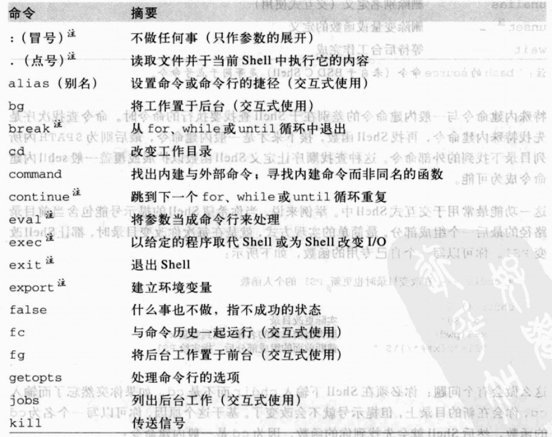
  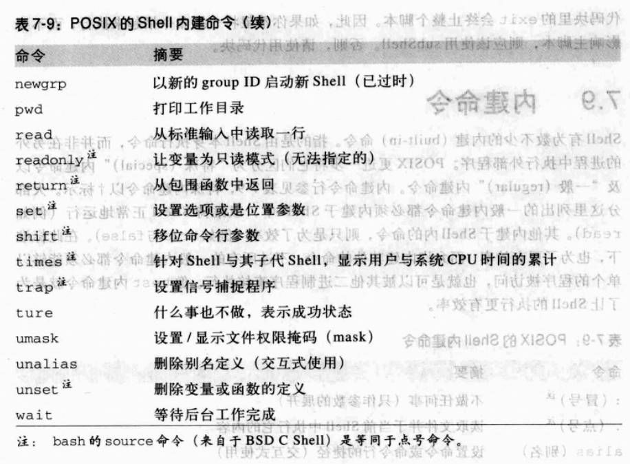
  
  ```
  1. alias, unalias: 分别用于别名的定义与删除。
  2. bg,fg,jobs,kill:用于工作控制，它是一个操作系统工具，可将g工作移动到后台执行，或从后台移除
  3. fc:即fix command。管理shell已使用过的命令，允许用户执行或编辑后执行
  4. times: 打印shell及其所有子进程所累积执行的cpu时间
  5. umask: 用来设置文件建立时权限掩码
  6. wait:用来等待所有后台的工作执行完成
  ```

* 当我们自定义的shell函数命令与内建的命令相同时，如果此时要调用内建的命令，可以用command命令
  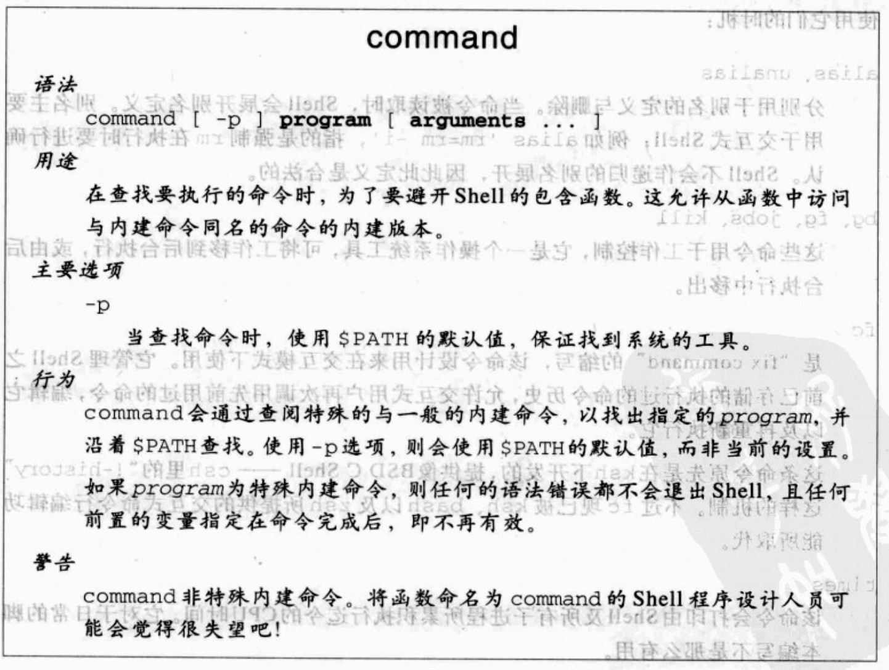
  


### 7.9.1 set命令

* set的基本语法
  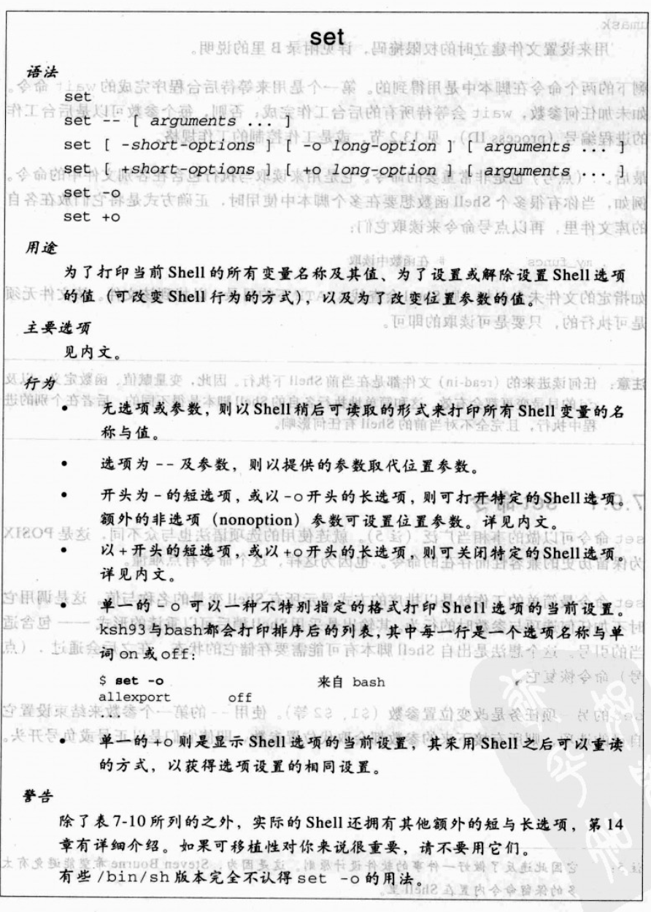

* set的部分选项
  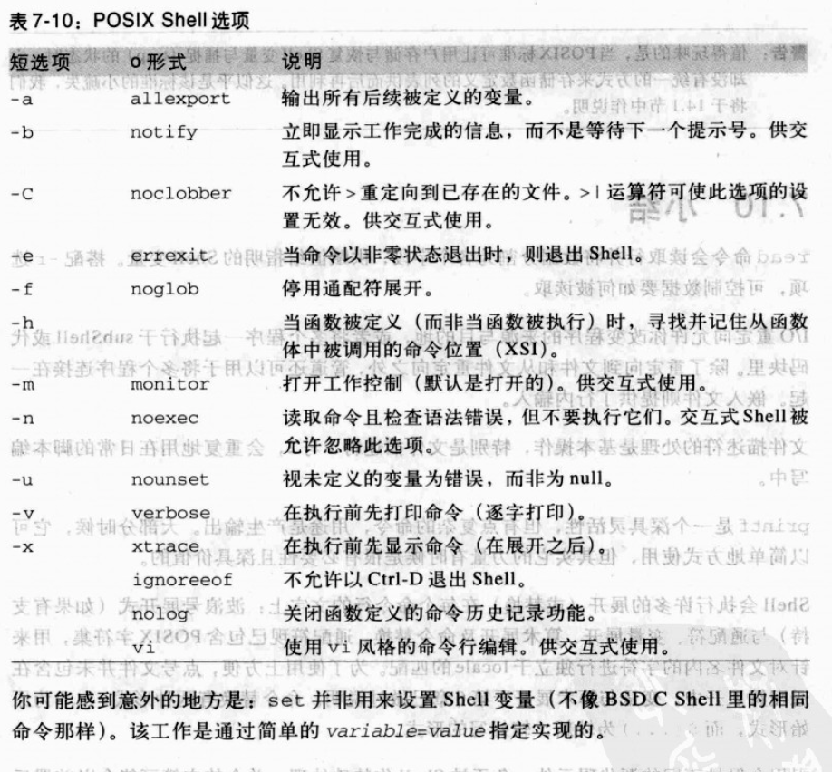
  
  
  
  
