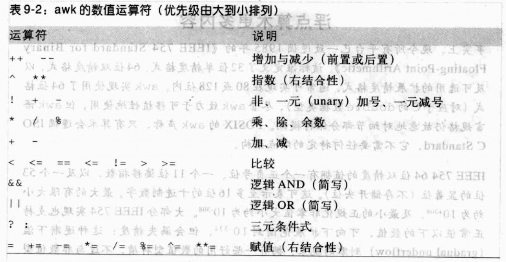
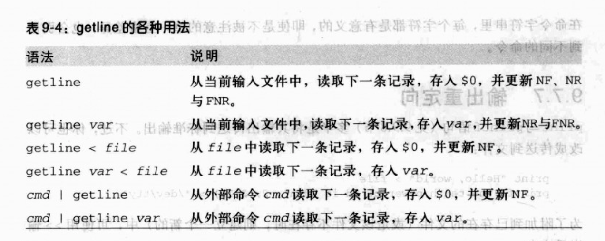
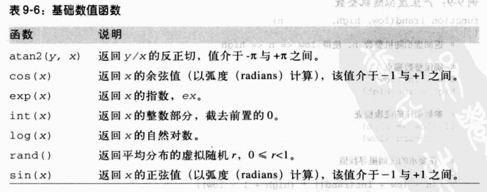
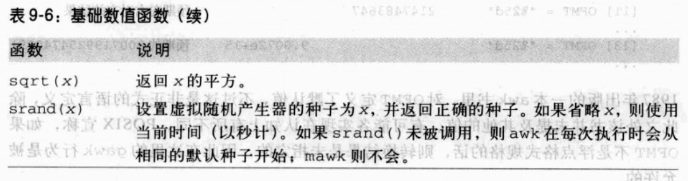

## 9.1 awk命令行

+ `awk [-F fs] [-v var=value...] 'program' [--] [var=value...] [file(s)]`
+ `awk [-F fs] [-v var=value...] -f programfile [--] [var=value...] [file(s)]`
    + `--`：指出awk本身已没有更进一步的命令选项。任何接下来的选项都可以被你的程序使用
    + `-F`:用来重新定义默认字段分隔字符. fs指定输入分隔符，fs可以时字符串或正则表达式
    
       ```
       awk -F '\t' '{...}' files FS="[\f\v]" files
       -F设置的值，应用到第一个文件组
       FS指定的值，则应用到第二个文件组
       ```
       
    + `-v`: 初始化设置变量传递给awk.使用字符串进行初始化时无须用引号，除非为了保护空白或特殊字符

    + 特殊文件名-(连字号)表示标准输入。

 
## 9.2 awk程序模型

+ `awk`把输入流看作一连串记录的集合，每条记录都可进一步细分为字段
+ 通常，一行就是一个记录，而字段则是由一个或多个非空白字符的单词组成
+ `awk`程序是`pattern { action }`形式的操作组合而成的。针对每个匹配于输入数据的模式，操作会被执行，且所有模式都会针对每条输入记录而检查。
  
   ```
   如action不存在，则默认为print
   如pattern不存在，则默认为每条记录
   pattern { action }   如模式匹配，则执行操作
   pattern              如模式匹配，则打印记录
           { action }   针对每条记录，执行操作
   ```
   
+ `awk`以`BEGIN`与`END`提供两种特殊模式
   
   - 与`BEGIN`关联的action只会执行一次，在任何命令行文件以及一般命令行赋值被处理之前，但在任何开头的-v选项指定已经完成之后。
   - `END`操作也是只执行一次，用于所有输入数据已被处理完之后。多用于产生摘要报告或是执行清除操作
   - `BENGIN`和`END`模式可以是任意顺序，但一般`BENGIN`位于第一个，`END`位于最后一个

   
## 9.3 程序元素

### 9.3.1 注释与空白

* awk的注释是从`#开始`到`该行结束`
* 单行语句跨行时，在前一行末尾要有`\`

### 9.3.2 字符串与字符串表达式

```
1. awk并无特殊的字符串连接运算符.两个连续的字符串，会自动连接在一起

   s = "A" "B" "C" "D"  s的值为"ABCD"

2. 字符串的比较
    
   使用关系运算符 ==, !=, > , < , >=, <= ...
   
3. 将数字转为字符串
   
   n = 123  s= "" n   s的值为"123"
   
4. ~(匹配)与!~(不匹配)让awk更容易使用正则表达式
    
   "ABC" ~ "^[A-Z]+$"
   
5. 两种变量:标量变量,数组变量
   
```

### 9.3.3 数字与数值表达式

```
1. 所有awk里的数字都以双精确度的浮点值表示
2. 字符串转数字

   s= "123"     n = 0 + s n的值为数字123
   s= "+123ABC" n = 0 + s n的值为数字123
   s= "ABC"     n = 0 + s n的值为数字0
   s= "ABC123"  n = 0 + s n的值为数字0
```


* 右结合:`a^b^c^d` 的运算顺序-> `a^(b^(c^d))`

### 9.3.4 标量变量

```
1. 保存单一值的变量叫做标量变量
2. awk变量在建立时其初始值为一个空字符串，但是当需要数值时，它会被视为0
3. awk变量名以ACSII字母或下划线开始，后面可用数字,字母，下划线
4. awk变量名与大小写有光.（foo, Foo, FOO是不同的变量）
5. 一般而言,局部变量全部用小写，全局变量首字母大写，内建变量则全是大写

```


### 9.3.5 数组变量

```
1. awk的数组变量包含0到多个数据项
2. 数组以[数字表达式]或[字符串表达式]作为索引
   
   telephone["Alice"] = "555-0134"
   telephone["Bob"]   = "555-0135"
   telephone["Alice"] = "555-0136"
   telephone["Alice"] = "555-0141"
3. awk里的数组无需声明也无需配置:数组的存储空间在引用新元素时会自动增长
4. 数组存储空间是稀疏的(sparse):只有那些确实被引用的元素才会配置
    
    x[1] = 3.14159
    x[10000000] = "ten million"
    
    不必填满元素2-9999999
5. awk并不要求所有元素都是相同类型
6. 数组删除操作某个元素 
   
   delete array[index]  删除某个元素
   delete array删除整个数组
   
7. 一个变量不能同时用作标量变量和数组变量

   x[1] = 123
   delete x
   x = 789  //awk发出错误提示
   
8. awk通过将"以逗号分隔的索引列表"看作一个字符串，而使用多个索引模拟数组 ???
    
    awk使用存储在内建变量SUBSEP里的无法打印字符串取代索引分隔字符
    print maildrop[53, "Oak Lane", "T4Q 7XV"]
    print maildrop["53" SUBSEP "Oak Lane" SUBSEP "T4Q 7XV"]
    
```


### 9.3.6 命令行参数

```
1. awk通过内建变量ARGC(参数计数)与ARGV(参数向量或参数值)，让命令行参数可用

$ cat showargs.awk
 
 BEGIN {
    print "ARGC =", ARGC
    for (k = 0; k < ARGC; k++) 
        print "ARGV[" k "] = [" ARGV[k] "]"
}

$ awk -v One=1 -v Two=2 -f showargs.awk Three=3 file1 Four=4 file2 file3

ARGC = 6
ARGV[0] = [awk]
ARGV[1] = [Three=3]
ARGV[2] = [file1]
ARGV[3] = [Four=4]
ARGV[4] = [file2]
ARGV[5] = [file3]

参数存储在项目0,1,...ARGC-1中。第0个项目是程序本身的名称

2. awk遇到`--`选项会立即停止将参数及时为选项。任何接下来看起来像是选项的参数，都必须由你的程序处理，并接着从ARGV中被删除，或者设置为空字符串
3. 单引号可保护程序内容不被Shell解释，所以可将一段程序存储在Shell变量中


```

## 9.3.7 环境变量

```
1. awk提供访问内建数组ENVIRON所有的环境变量

$ awk 'BEGIN { print ENVIRON["HOME"]; print ENVIRON["USER"]}'

/home/jones
jones
   
2. 对ENVIRON加入，删除，修改的项目无法传递给子进程，所以应当把ENVIRON视为一个只读数组 (POSIX要求子进程继承awk启动时生效的环境)

```

## 9.4 记录与字段

### 9.4.1 记录分隔字符

记录通常是被换行字符所分隔的数行文本。内建变量`RS`为记录分隔字符

### 9.4.2 字段分隔字符

* `FS`作为字段分隔符，默认值为单一空格(space)，一个或多个空白字符(空格与制表符)，以及行的开头与结尾的空白，都将被忽略。
  
  ```
  下面的两行输入对于awk程序是一样的
  alpha beta gamma
     alpha    beta   gamma
  ```
  
 * 当设置 `FS= "[ ]"`,前置和结尾的空白不会再被忽略

 
### 9.4.3 字段

字段可以特殊名称$1,$2,$3...$NF供awk程序使用, $0引用到当前记录

## 9.5 模式与操作

### 9.5.1 模式
* 模式是由字符串与/或数值表达式构建而成
   
   ```
   NF == 0                                 选定空记录
   NF > 3                                  选定拥有三个字符安以上的记录
   NF < 5                                  选定第1到4条记录
   (FNR == 3) && (FILENAME ~/[.][ch]$/)    于c来源文件中选定记录3
   $1 ~ /jones/                            选定字段1里有"jones"的记录
   /[Xx][Mm][Ll]/                          选定含有"XML"的记录，不区分大小写
   $0 ~/[Xx][Mm][Ll]                       同上
   
    ```
* awk可以使用范围表达式.以逗号隔开的两个表达式，从左匹配到右。
   
   ```
   (FNR == 3), (FNR == 10)             选定每个输入文件里的记录
   ```

## 9.6 在awk里的单行程序

具体用到时，再了解

## 9.7 语句

### 9.7.1 连续执行

连续执行是以一个语句一行或以分号隔开的方式，提供一连串语句列表。
  
  ```
  n = 123
  s = "ABC"
  t = s n
  
  上面的语句可写成 n = 123; s = "ABC"; t = s n
  
  ```
  
### 9.7.2 条件式执行

```
if (expression1)
     statement1
else if (expression2)
     statement2
...
else 
   statementN
```

### 9.7.3 重复执行

```
1. while (expression)

    statement

2. do
    statement
   while

3. for (expr1; expr2; expr3)
    statement
    
4. for (key in array)
    statement

```

### 9.7.4 数组成员的测试

xxxxx

### 9.7.5 其他的流程控制语句

xxxx

`exit n `: 退出，并返回状态码给shell

### 9.7.6 用户控制的输入




### 9.7.7 输出重定向

* print与printf默认是输出到标准输出
* `print content > file`  输出到文件file中
* `pritn content >> file` 输出到文件file中，如果文件不存在，则创建file。如果存在，则附加内容到file中。
* awk打开文件后要用close(file)关闭文件

### 9.7.8 执行外部程序

* system(command)函数调用外部程序命令

## 9.8 用户定义函数

```
function name(arg1,arg2,...,argn) {
  statement(s)
}


```

## 9.9 字符串函数

* `length(string)`返回字符串string的长度

### 9.9.1 子字符串提取

* `substr(string, start, len)` . 字符的位置，从1开始编号[图片]

### 9.9.2 字母大小写转换

* `tolower(string)`:转成小写  `toupper(string)`:转成大写

### 9.9.3 字符串查找

* `index(string,subStr)`: 查找字符串中是否有subStr字符串，并返回subStr字符串的起始位置。如果找不到就返回0

### 9.9.4 字符串匹配

* `match(string, regexp)`: 将string与正则表达式regexp匹配.如果匹配则返回匹配string的索引，不匹配则返回0

### 9.9.5 字符串替换

* `sub(regexp, replacement, target)`将target与正则表达式regexp进行匹配，将最左边最长的匹配部分替换为字符串replacement.
* `gsub(regexp, replacement, target)`全局替换

### 9.9.6 字符串替换

* split(string, array, regexp):将string切割为片段，并存储在array中，匹配regexp的字符串作为分隔字符串。如果regexp不存在，则使用内建字段FS的当前默认值。返回值为array里元素的数量


### 9.10 数值函数




